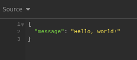
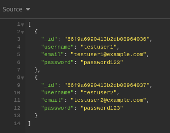
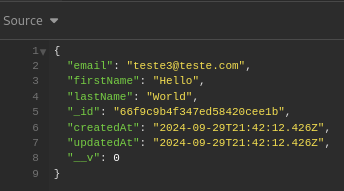

# 🌐 API REST em TypeScript com Node.js

   

Projeto de API REST modularizada, construída com **Node.js** e **TypeScript**, seguindo os princípios REST.
## ✨ Funcionalidades

- 🛠️ CRUD de recursos (Create, Read, Update, Delete)
- 🔒 Autenticação e rotas protegidas
- 🛡️ Validação de dados
- 📄 Documentação automatizada com Swagger
- 🗄️ Integração com bando de dados não relacional MongoDB
- 🗄️ Integração com banco de dados relacional PostgreSQL

## 🛠️ Tecnologias Utilizadas

- **Node.js**: 
- **Express**: 
- **TypeScript**: 
- **Jest**: 
- **Swagger**: 
- **PostgreSQL/MySQL**:  
- **TypeORM**: 

## ⚙️ Requisitos

- **Node.js** versão 14 ou superior 
- **npm** ou **yarn**  
- **PostgreSQL** ou **MySQL** e **MongoDB** como banco de dados   


## 🚀 Instalação

1. Clone:

```bash
git clone https://github.com/usuario/projeto-api-ts.git
```

## 💥 Get Started

Para começar siga as intruções no [GET_STARTED.md](GET_STARTED.md)

## ❄️ API ROUTES

### Rota '/' => 'Hello, World'



### Rota '/users' => UserController.JSON

#### GET



#### POST




